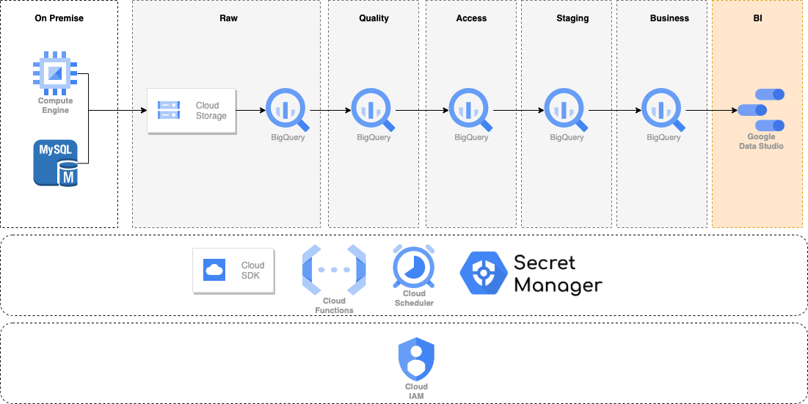

# Westeros ELT project

This is a ELT project to apply of the knowledge about GCP. Westeros is a ficticious company that has data on a MySQL database and a file that is being stored in a Compute Engine Instance.

# About the infrastructure

- We use `gsutil cp` command to copy the `csv` file from the instance to the Cloud Storage Bucket.
- Cloud Functions are a serverless solution that along with Cloud Scheduler, make a great decision for simple pipelines and allow the company to save money because it will be billed for the function’s execution time, and you can keep them as simple as possible.

# Overview

